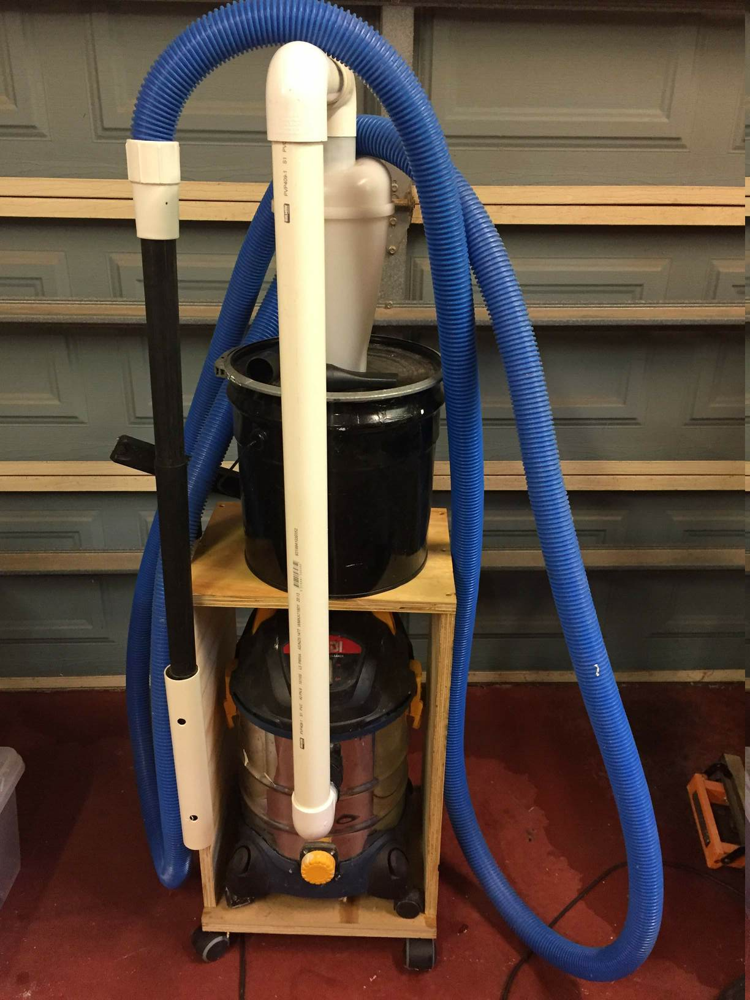
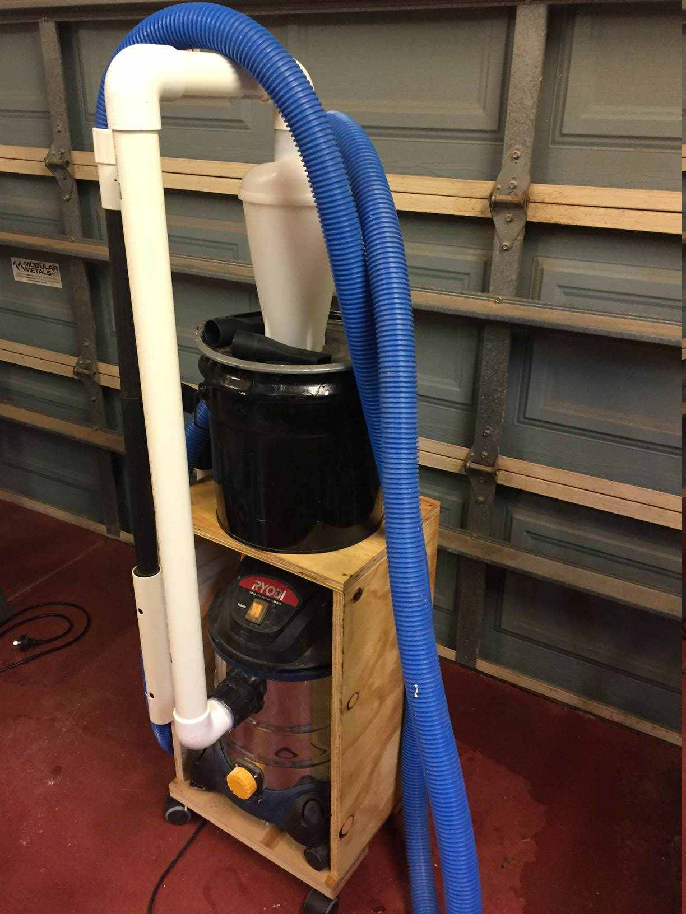
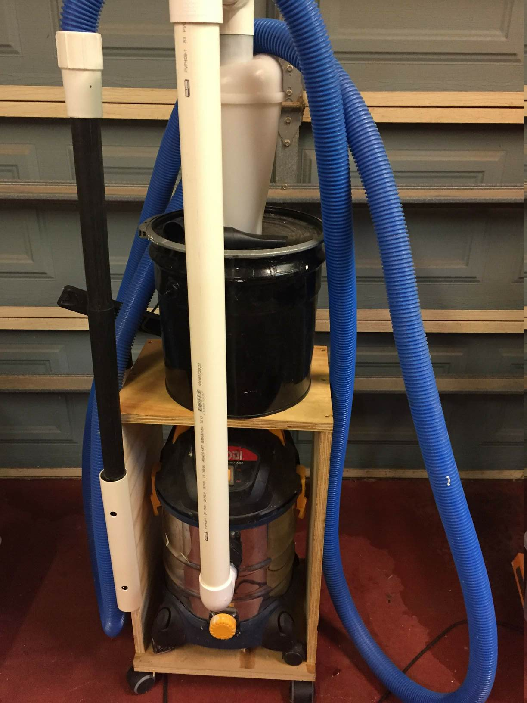
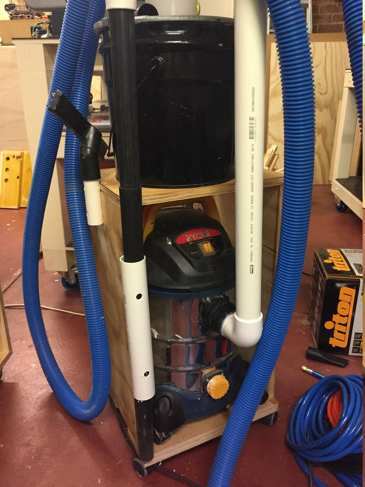
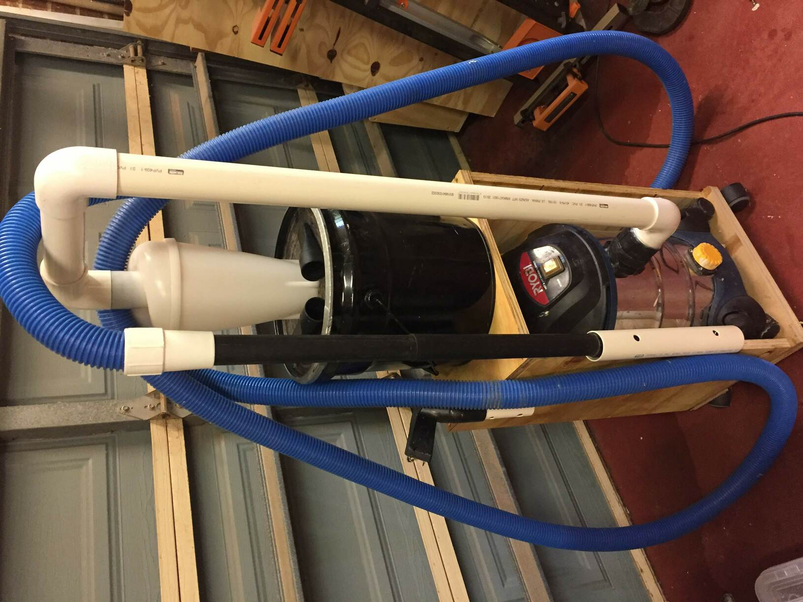

# Vacuum Caddy

# Notes

Caddy on wheels for Ryobi shop vacuum with cyclone gravity assist dust extractor
thing. 40mm low pressure irrigation pipe fittings, vacuum hose is a pool pipe. 

90mm pvc bend hot-snotted to existing vacuum after removal of existing pipe
fitting.

Coated with clear polyurethane.

Its a bit top-heavy, can do with pipe management.
